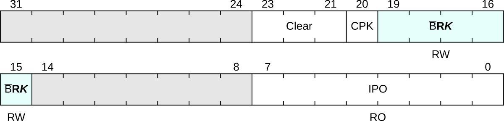
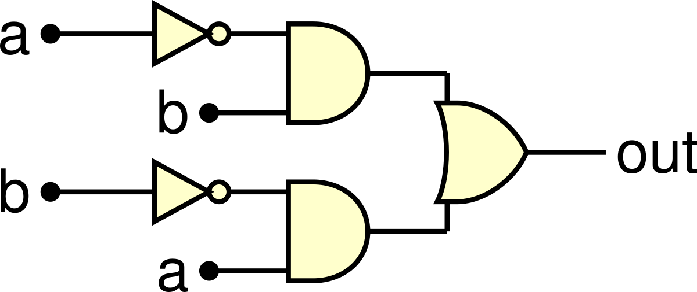
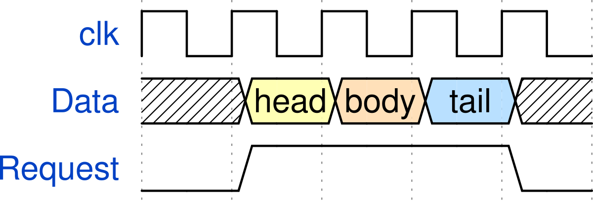

# wavedromScape

[WaveDrom's](https://wavedrom.com/) digital timing diagram extension for [Inkscape](https://inkscape.org/).

**This is a work-in-progress project. The current state is BUGGY!  =)**





## main features

The main features of this extension are

 - You can create wavedrom digital timing diagram using Inkscape

## Current version

Compatibility table

|  Inkscape        |  wavedromScape  | inkscapeMadeEasy | Receive updates?|
|------------------|-----------------|------------------|-----------------|
|       1.0        |  1.0 (latest)   |   1.0 (latest)   | YES             |
| 0.48, 0.91, 0.92 |   NO SUPPORT    |  0.9x (obsolete) | NO              |


**Latest version:** The latest version of **wavedromScape** is **1.0**. This version is compatible with Inkscape 1.0 and up only. It is **incompatible** with older Inkscape versions! There is no goal to develop wavedromScape for Inkscape <1.0.

# Installation and requirements

## Requirements

- You will need [inkscapeMadeEasy](https://github.com/fsmMLK/inkscapeMadeEasy) plugin installed. Check the compatibility table above to know the version you need.


**wavedromScape** depends on [wavedrompy](https://github.com/wallento/wavedrompy) python module. A custom built version of wavedrompy is already incorporated in this extension. You do **NOT** need to install it.

## Installation procedure

**wavedromScape** was developed using Inkscape 1.0 in Linux (Kubuntu 18.04). It should work in different OSs too as long as all requirements are met.

1. Install [inkscapeMadeEasy](https://github.com/fsmMLK/inkscapeMadeEasy), **version 1.0** (latest). Follow the instructions in the manual page. **Note:** No LaTeX text is used in **wavedromScape**, so there is no reason to install LaTeX support if you don't have any other extensions that employ inkscapeMadeEasy. However, you must follow the instructions and disable LaTeX support since it is enabled by default. See inkscapeMadeEasy's documetation pages.

2. **wavedromScape** installation

    1. Go to Inkscape's extension directory with a file browser. Your inkscape extension directory can be accessed by opening Inkscape and selecting ``Edit > Preferences > System``. Look for the item **User Extensions**  field. There is a button on the right of the field  that will open a file explorer window in that specific folder.

    2. Create a subfolder in the extension directory with the name ``wavedromScape``. **Important:**  Be careful with upper and lower case letters. You must write as presented above.

    3. Download **wavedromScape** files and place them inside the directory you just created.

       You don't have to copy all files from Github. The files you will need are inside the ``latest`` folder. In the end you must have the following files and directories in your Inkscape extension directory.

       **LaTeX users:** the file `wavedromScapePreamble.tex` contains the macros defined in this plugin. You can add your own macros to this file. You can also add macros to ``inkscapeMadeEasy/basicLatexPackages.tex``. In this case the same macros will be accessible by all plugins that employ inkscapeMadeEasy.

        ```
        inkscape
         ┣━━extensions
         ┋   ┣━━ inkscapeMadeEasy      <-- inkscapeMadeEasy folder
             ┃    ┣━━ inkscapeMadeEasy_Base.py
             ┃    ┣━━ inkscapeMadeEasy_Draw.py
             ┃    ┣━━ inkscapeMadeEasy_Plot.py
             ┃    ┗━━ basicLatexPackages.tex
             ┃
             ┣━━ textext               <-- texText folder (if you installed textText)
             ┃    ┋
             ┃
             ┣━━ wavedromScape        <-- wavedromScape folder
             ┋    ┣━━ wavedromScape.inx
                  ┣━━ wavedromScape.py
                  ┗━━ wavedrompy        <-- wavedrompy folder
                         ┋
       
        NOTE: You might have other sub folders inside the extensions directory. They don't interfere with the plugin.
        ```

# Usage

The extension can be found under `extensions > fsmMLK > Circuit symbols` menu.

This extension is presented in one tab that allows you write the string that specifies the diagram or specify a text file (.txt) with the description of the diagram. Check the [Examples](#examples) section and the tutorials [here](https://wavedrom.com/tutorial.html) and [here](https://wavedrom.com/tutorial2.html)

# Examples

All examples presented here were extracted from the tutorials [here](https://wavedrom.com/tutorial.html) and [here](https://wavedrom.com/tutorial2.html) and from [wavedrompy](https://github.com/wallento/wavedrompy) page. Check these links for further information.


```
{ "signal": [
 { "name": "CK",   "wave": "P.......",                                              "period": 2  },
 { "name": "CMD",  "wave": "x.3x=x4x=x=x=x=x", "data": "RAS NOP CAS NOP NOP NOP NOP", "phase": 0.5 },
 { "name": "ADDR", "wave": "x.=x..=x........", "data": "ROW COL",                     "phase": 0.5 },
 { "name": "DQS",  "wave": "z.......0.1010z." },
 { "name": "DQ",   "wave": "z.........5555z.", "data": "D0 D1 D2 D3" }
]}
```


```
{ "signal": [
  { "name": "pclk", "wave": "p......." },
  { "name": "Pclk", "wave": "P......." },
  { "name": "nclk", "wave": "n......." },
  { "name": "Nclk", "wave": "N......." },
  {},
  { "name": "clk0", "wave": "phnlPHNL" },
  { "name": "clk1", "wave": "xhlhLHl." },
  { "name": "clk2", "wave": "hpHplnLn" },
  { "name": "clk3", "wave": "nhNhplPl" },
  { "name": "clk4", "wave": "xlh.L.Hx" }
]}
```


```
{"reg": [
  { "name": "IPO",   "bits": 8, "attr": "RO" },
  {                  "bits": 7 },
  { "name": "<o>B</o><b>R<i>K</i></b>",   "bits": 5, "attr": "RW", "type": 4 },
  { "name": "CPK",   "bits": 1 },
  { "name": "Clear", "bits": 3 },
  { "bits": 8 }
  ]
}
```


```
{ "assign":[
  ["out",
    ["|",
      ["&", ["~", "a"], "b"],
      ["&", ["~", "b"], "a"]
    ]
  ]
]}
```



```
{ "assign":[
  ["g0", ["^", "b0", "b1"]],
  ["g1", ["^", "b1", "b2"]],
  ["g2", ["^", "b2", "b3"]],
  ["g3", ["=", "b3"]]
]}
```


```
{ "assign":[
    ["b3", "g3"],
  ["b2", ["^", "b3", "g2"]],
  ["b1", ["^", "b2", "g1"]],
  ["b0", ["^", "b1", "g0"]]
]}
```


```
{ "assign":[
    ["z", ["~&",
    ["~^", ["~", "p0"], ["~", "q0"]],
    ["~^", ["~", "p1"], ["~", "q1"]],
    ["~^", ["~", "p2"], ["~", "q2"]],
    "...",
    ["~^", ["~", "p7"], ["~", "q7"]],
    ["~","~en"]
  ]]
]}
```


```
{ "assign":[
    ["out",
    ["XNOR",
      ["NAND",
        ["INV", "a"],
        ["NOR", "b", ["BUF","c"]]
      ],
      ["AND",
        ["XOR", "d", "e", ["OR","f","g"]],
        "h"
      ]
    ]
  ]
]}
```


```
{ "signal": [
  { "name": "clk",         "wave": "p.....|..." },
  { "name": "Data",        "wave": "x.345x|=.x", "data": ["head", "body", "tail", "data"] },
  { "name": "Request",     "wave": "0.1..0|1.0" },
  {},
  { "name": "Acknowledge", "wave": "1.....|01." }
]}
```


```
{ "signal": [
  {    "name": "clk",   "wave": "p..Pp..P"},
  ["Master",
    ["ctrl",
      {"name": "write", "wave": "01.0...."},
      {"name": "read",  "wave": "0...1..0"}
    ],
    {  "name": "addr",  "wave": "x3.x4..x", "data": "A1 A2"},
    {  "name": "wdata", "wave": "x3.x....", "data": "D1"   }
  ],
  {},
  ["Slave",
    ["ctrl",
      {"name": "ack",   "wave": "x01x0.1x"}
    ],
    {  "name": "rdata", "wave": "x.....4x", "data": "Q2"}
  ]
]}
```


```
{ signal: [
  { name: "CK",   wave: 'P.......',                                              period: 2  },
  { name: "CMD",  wave: "x.3x=x4x=x=x=x=x", data: "RAS NOP CAS NOP NOP NOP NOP", phase: 0.5 },
  { name: "ADDR", wave: "x.=x..=x........", data: "ROW COL",                     phase: 0.5 },
  { name: "DQS",  wave: "z.......0.1010z." },
  { name: "DQ",   wave: "z.........5555z.", data: "D0 D1 D2 D3" }
]}
```


```
{ signal: [
  { name: "clk",     wave: "p...." },
  { name: "Data",    wave: "x345x",  data: ["head", "body", "tail"] },
  { name: "Request", wave: "01..0" }
  ],
  config: { hscale: 1 }
}
```



```
{signal: [
  {name:'clk', wave: 'p.....PPPPp....' },
  {name:'dat', wave: 'x....2345x.....', data: 'a b c d' },
  {name:'req', wave: '0....1...0.....' }
],
head: {text:
  ['tspan',
    ['tspan', {class:'error h1'}, 'error '],
    ['tspan', {class:'warning h2'}, 'warning '],
    ['tspan', {class:'info h3'}, 'info '],
    ['tspan', {class:'success h4'}, 'success '],
    ['tspan', {class:'muted h5'}, 'muted '],
    ['tspan', {class:'h6'}, 'h6 '],
    'default ',
    ['tspan', {fill:'pink', 'font-weight':'bold', 'font-style':'italic'}, 'pink-bold-italic']
  ]
},
foot: {text:
  ['tspan', 'E=mc',
    ['tspan', {dy:'-5'}, '2'],
    ['tspan', {dy: '5'}, '. '],
    ['tspan', {'font-size':'25'}, 'B '],
    ['tspan', {'text-decoration':'overline'},'over '],
    ['tspan', {'text-decoration':'underline'},'under '],
    ['tspan', {'baseline-shift':'sub'}, 'sub '],
    ['tspan', {'baseline-shift':'super'}, 'super ']
  ],tock:-5
}
}
```


```
{ signal: [
  { name: 'A', wave: '01........0....',  node: '.a........j' },
  { name: 'B', wave: '0.1.......0.1..',  node: '..b.......i' },
  { name: 'C', wave: '0..1....0...1..',  node: '...c....h..' },
  { name: 'D', wave: '0...1..0.....1.',  node: '....d..g...' },
  { name: 'E', wave: '0....10.......1',  node: '.....ef....' }
  ],
  edge: [
    'a~b t1', 'c-~a t2', 'c-~>d time 3', 'd~-e',
    'e~>f', 'f->g', 'g-~>h', 'h~>i some text', 'h~->j'
  ]
}
```


```
{ signal: [
  { name: 'A', wave: '01..0..',  node: '.a..e..' },
  { name: 'B', wave: '0.1..0.',  node: '..b..d.', phase:0.5 },
  { name: 'C', wave: '0..1..0',  node: '...c..f' },
  {                              node: '...g..h' },
  {                              node: '...I..J',  phase:0.5 },
  { name: 'D', wave: '0..1..0',  phase:0.5 }
  ],
  edge: [
    'b-|a t1', 'a-|c t2', 'b-|-c t3', 'c-|->e t4', 'e-|>f more text',
    'e|->d t6', 'c-g', 'f-h', 'g<->h 3 ms', 'I+J 5 ms'
  ]
}
```


